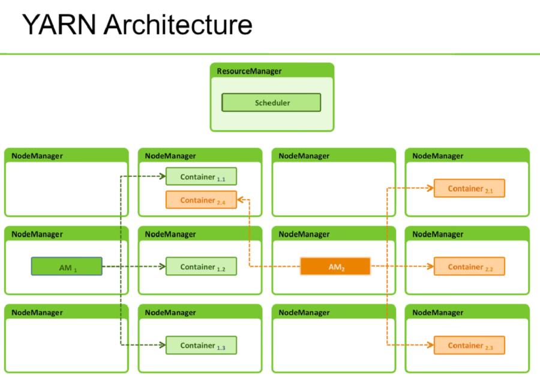
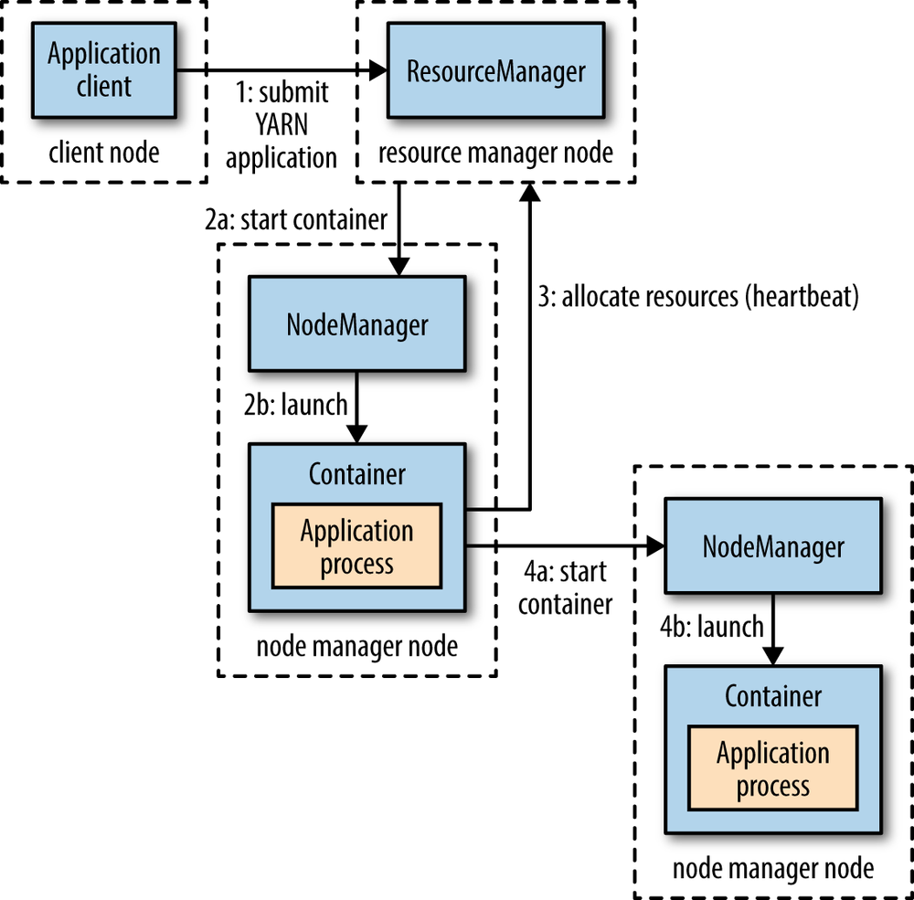
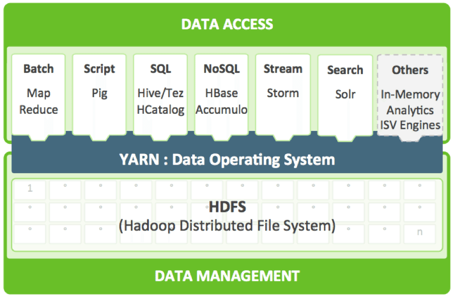

# yarn structure

* https://wikidocs.net/22899

* https://hadoop.apache.org/docs/r3.3.1/hadoop-yarn/hadoop-yarn-site/YARN.html

* 등장 배경

  * 하둡1에서 JobTracker가 애플리케이션 라이프 사이클 관리, 클러스터 리소스 관리를 모두 담당하여 병목현상을 일으켰다(따라서 최대 4000대의 노드까지만 관리 가능)
  * JobTracker의 애플리케이션은 맵리듀스 작업만 처리할 수 있어서 SQL 기반 작업처리, 인메모리 기반의 작업처리에 어려움이 있었다
  * 이러한 단점을 극복하기 위해 YARN 아키텍처가 도입되었다

* 구성

  * JobTracker기능을 분리

  * Resource Manager와 Node Manager

    * 자원관리
    * Resource Manager가 Node Manager로부터 정보를 전달받아 클러스터 전체의 자원 관리

  *  Application Master와 Container

    * 애플리케이션 라이프 사이클 관리

    * 클라이언트가 Resource Manager에 애플리케이션을 제출하면, Resource Manager는 비어있는 노드에서 Application Master를 실행한다

    * Resource Manager는 Application Master에서 요청이오면 비어있는 자원을 사용할 수 있도록 처리

    * 자원을 할당받으면 각 노드에 Container로 실제 작업 진행

    * Container 작업이 종료되면 결과를 Application Master에게 알리고, Application Master는 모든 작업이 종료되면 Resource Manager에 알리고 자원을 해제한다

      

      

* 실행시킬 수 있는 애플리케이션 예

  * MapReduce

  * Pig

  * Hive/Tez

  * HCatalolg

  * HBase

  * Accumulo

  * Storm

  * Solr

    