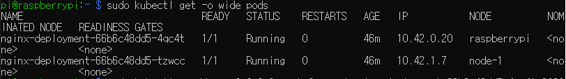
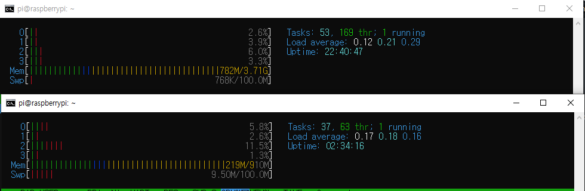
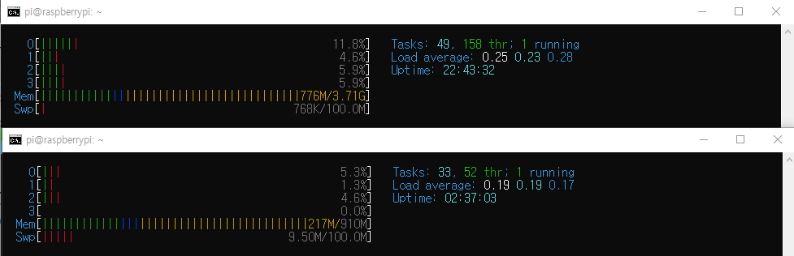

# raspberry default

* raspbian 64bit(aarch64==armv8, devian계열)

* 키보드 입력 설정
  * https://dullwolf.tistory.com/17
  * raspberry 400 us자판에서 올바른 키세팅을 사용하려면 Korean말고 US선택
  
* 와이파이 연결
  * 라즈베리식 wifi 설정
    * https://webnautes.tistory.com/903
  * linux iwlist wlan0 scan, /etc/wpa_supplicant/wpa_supplicant.conf
    * https://webnautes.tistory.com/141
  
* raspberry package 설치

  * https://m.blog.naver.com/itperson/220653088291

  ```shell
  # installed list
  apt --installed list
  # install vim
  apt-get install -y vim
  # package information update
  apt-get update
  # can be upgraded list
  apt-get --just-print upgrade
  # search package(start with vim)
  apt-cache search ^vim
  # delete package with config(delete vim)
  apt-get --purge remove vim
  # add repository
  apt-add-repository ppa:<repository address>
  ```

* vim 설치

* sudoer 추가

  * /etc/sudoers에 추가

    ```shell
    pi	ALL=(ALL) NOPASSWD:ALL
    zeppy ALL=(ALL) NOPASSWD:/bin/mkdir,/bin/rmdir
    ```

* password 설정

* ssh 설정

  * [ssh](../ssh/ssh.md)
  
* tree 설치

# raspberry virtualization

* 라즈베리용 도커 설치

  * [raspberry docker](./raspberry docker.md)
  
* 도커 sudo 없이 실행설정

* 도커 멀티 플랫폼 빌드(buildx)

* 쿠버네티스 설치(k3s)
  
  * 라즈베리4 4g 4대로 클러스터 구축 사례
  
    * https://github.com/REBELinBLUE/k3s-on-raspbian/tree/main/setup
  
  * cgroup enable
  
    ```shell
    sudo sed -i '$ s/$/ cgroup_enable=cpuset cgroup_enable=memory cgroup_memory=1 swapaccount=1/' /boot/cmdline.txt
    ```
  
  * k3s 서비스로 설치
  
    ```shell
    # master
    curl -sfL https://get.k3s.io | sh -
  # master K3S_TOKEN
    sudo cat /var/lib/rancher/k3s/server/node-token
    # worker
    curl -sfL https://get.k3s.io | K3S_URL=https://myserver:6443 K3S_TOKEN=XXX sh -
    ```
    
  
* k3s 완전삭제

  ```shell
  sudo /usr/local/bin/k3s*-uninstall.sh
  sudo rm -rf /var/lib/{docker,containerd} /etc/{cni,containerd,docker} /var/lib/cni
  sudo rm -rf /var/log/{containers,pods}
  sudo reboot
  ```

  

* 배포 예시

  * nginx 배포

    ```shell
     sudo kubectl apply -f https://k8s.io/examples/application/deployment.yaml
    ```

  * pod 상태 확인

    ```shell
    sudo kubectl get pods
    ```

  * 포트포워딩으로 파드 작동 확인

    * https://kubernetes.io/ko/docs/tasks/run-application/run-stateless-application-deployment/
    * pod이름, expose port, pod port
    * address 옵션은 로컬이 아닌 다른 어느곳에서도 접근 가능하도록 설정
    * nginx 소개 페이지가 랜더링됨
    * 127.0.0.1과 0.0.0.0의 차이 : 자기가 자신에게로만 / 모두가 자신에게로

    ```shell
    sudo kubectl --address 0.0.0.0 port-forward nginx-deployment-66b6c48dd5-4qc4t 8080
    :80
    curl localhost:8080
    # 포트열린지 확인
    netstat -an | grep "LISTEN"
    ```

  * 파드 실행중일 때 상태

    

    

  * 파드 종료후 상태

    

* 다른예제들이 배포가 제대로 안되는 문제점

  * retail-project-dev

    * https://dev.to/fransafu/the-first-experience-with-k3s-lightweight-kubernetes-deploy-your-first-app-44ea

      ```shell
      curl -X GET -L https://gist.githubusercontent.com/fransafu/4075cdcaf2283ca5650e71c7fd8335cb/raw/19d7cfa0f82f1b66af6e39389073bcb0108c494c/simple-rest-golang.yaml > simple-rest-golang.yaml
      sudo kubectl apply -f simple-rest-golang.yaml
      ```

  * kubernetes interactive

    * https://kubernetes.io/ko/docs/tutorials/kubernetes-basics/deploy-app/deploy-interactive/

      ```shell
      kubectl create deployment kubernetes-bootcamp --image=gcr.io/google-samples/kubernetes-bootcamp:v1
      ```

  * 짐작되는 이유 : arm을 지원안하는 이미지 사용

# raspberry development environment

* DDNS 설정으로 외부에서의 접근

  * 중간에 모뎀을 거친다면
    * https://itfix.tistory.com/163
  * vpn 접속 후 로컬ip로 접근
* git 설치
* java 설치
* 호스트 설정
  * ip고정

# raspberry status check

* 온도 모니터링

  ```bash
  # bash, not sh
  printf "cpu temp\\t%.3f\\n" "$(</sys/class/thermal/thermal_zone0/temp)e-3"
  printf "gpu temp\\t%.1f\\n" "$(vcgencmd measure_temp | grep  -o -E '[[:digit:].]+')"
  ```

* 디스크 공간 확인

  ```bash
  df -h /
  tree -dh --du
  # big file (MB)
  du -am | sort -nr | head -20
  
  ```

* 인터넷 속도 테스트

  ```bash
  sudo apt-get install -y speedtest-cli
  speedtest --json
  ```

* 디스크 읽기 쓰기 속도 측정

* 와이파이 끄기

  ```shell
  sudo ifconfig wlan0 down
  ```

* 와이파이 속도 측정

  * https://forums.raspberrypi.com/viewtopic.php?t=280110
  * flirc 메탈 케이스는 와이파이 속도를 줄인다
  * cat6 선도 정상 허브도 정상
  * 허브에 연결을 느슨하게 함, 똑 소리나도록 밀어넣으니 100Mbit -> 1000Mbit로 증가
  * 공유기-허브 연결이 제대로 안되면 다른 ip대역 할당이됨
  * 허브에 랜선 연결은 똑소리나서 더이상 안들어갈 정도까지 넣음
  * iperf(2버전)으로 서로간의 인트라넷 속도 측정(3버전은 호환안됨)
  
* IP 고정

  * /etc/dhcpcd.conf

    ```shell
    interface eth0
    static ip_address=192.168.0.2
  static routers=192.168.0.1
    static domain_name_servers=192.168.0.1 8.8.8.8
    ```
  
  * 설정 적용
  
    ```shell
  	sudo /etc/init.d/networking restart
    sudo reboot
  	```
  
  * ssh에서 주변 host 정보 등록(~/.ssh/config)
  
    ```shell
    Host master
            Hostname 192.168.0.101
            User pi
    
    Host node-1
            Hostname 192.168.0.102
            ForwardAgent yes
            User pi
            ProxyCommand ssh -A master -W %h:%p
    ```
  
  * 주변 host 정보 등록(/etc/hosts)
  
    ```shell
    192.168.0.101 master
    192.168.0.102 node-1
    ```
  
  * host이름 바꾸기
  
    * 같은 이름이면 node를 제대로 인식 못함
  
      ```shell
      hostnamectl set-hostname node-1
      ```
  
      

